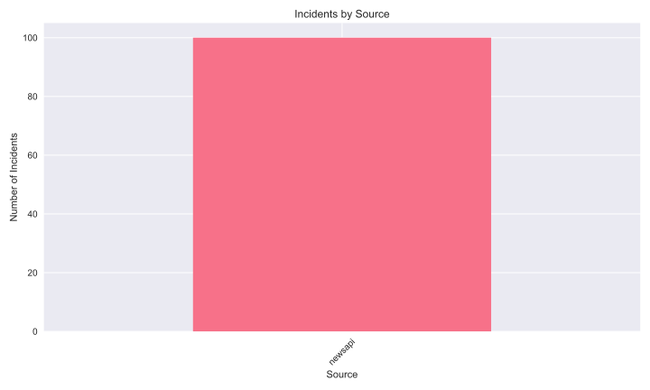
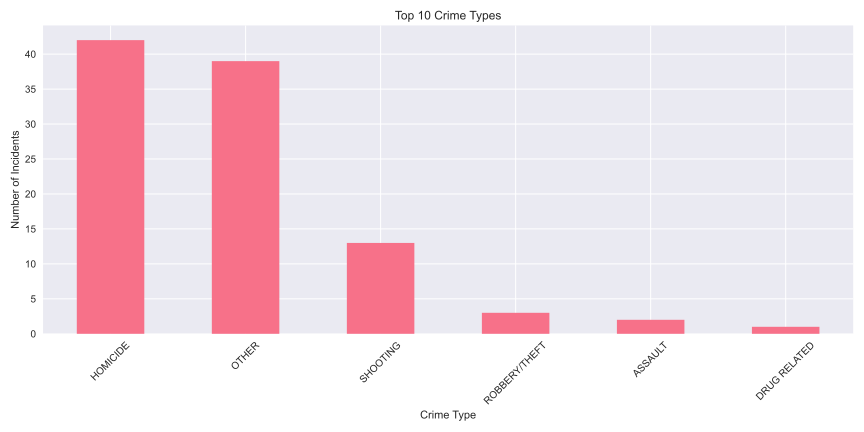

# Crime Data Analysis
Last updated: Sun Dec  8 15:46:04 UTC 2024

## Latest Analysis

Loaded 269 incidents
Date range: 2024-01-01 00:00:00 to 2024-12-07 15:45:31

Incidents by source:
source
newsapi       169
chicago_pd    100
Name: count, dtype: int64

Report saved to reports/latest_analysis.md
y Distribution](images/hourly_distribution.svg)

## Source Distribution

## Crime Types

## Recent Incidents

### HOMICIDE on 2024-12-07 15:45
- Location: NDTV News
- Description: In a bizarre and grisly tale of murder, a man was killed and his skull was used for alleged occult practices by four men in the hope of getting crores of rupees on the instructions of two "tantriks", who learnt "black magic from YouTube".

### OTHER on 2024-12-07 15:36
- Location: [Removed]
- Description: [Removed]

### OTHER on 2024-12-07 15:35
- Location: HackRead
- Description: Operation Destabilise was a major international operation led by the UK's National Crime Agency (NCA) to dismantle two Russian-speaking criminal networks: Smart and TGR. These networks were backbone in laundering billions of dollars for various criminal activ…

### HOMICIDE on 2024-12-07 15:21
- Location: Screen Rant
- Description: Murder in a Small Town’s season 1 finale left burning questions for the Fox murder mystery show to answer if Karl and Cassandra’s story continues.

### HOMICIDE on 2024-12-07 15:14
- Location: NDTV News
- Description: A 19-year-old man was arrested for allegedly being involved in killing a seven-month pregnant woman and burying her body in a pit in Haryana, police said on Saturday.

Analysis generated at: Sun Dec  8 15:46:04 UTC 2024
