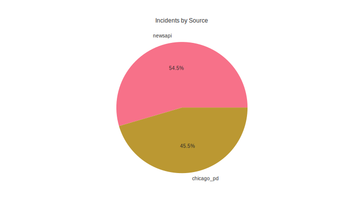
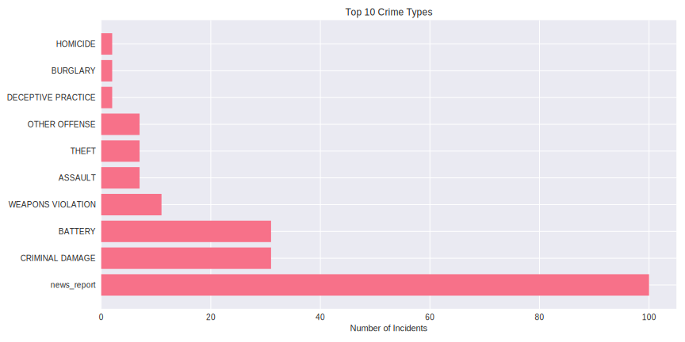

Loaded 230 incidents
Date range: 2024-01-01 00:00:00 to 2024-12-07 12:38:50

Incidents by source:
source
newsapi       130
chicago_pd    100
Name: count, dtype: int64

Report saved to reports/latest_analysis.md
y Distribution](images/hourly_distribution.svg)

## Source Distribution

## Crime Types

## Recent Incidents

### HOMICIDE on 2024-12-07 12:38
- Location: Newsweek
- Description: Police have yet to identify the assailant who gunned down the CEO of United Healthcare in New York City on December 4.

### HOMICIDE on 2024-12-07 12:33
- Location: CNN
- Description: Ellen Greenberg was found dead in 2011 in her Philadelphia apartment with a knife in her chest. Despite contradictory evidence, her death was ruled a suicide. Years later, her parents are still fighting to find the truth.

### HOMICIDE on 2024-12-07 12:00
- Location: CBC News
- Description: A man living in Winnipeg who was extradited to New Jersey last week after being linked to a decades-old cold case homicide has a long history of violence on both sides of the border.

### HOMICIDE on 2024-12-07 11:55
- Location: Nakedcapitalism.com
- Description: Our vocal daily links: US obesity rising, Lond Covid, Romania coup, Syria jihadist advance freakout, Meta hearts fossil fuels, China manufacturing, SKorera impachment checked, moar Israel genocide, SSN sales curbed? UnitedHealth murder celebrations continue, …

### OTHER on 2024-12-07 11:30
- Location: Wired
- Description: Plus: Russian spies keep hijacking other hackers’ infrastructure, Hydra dark web market admin gets life sentence in Russia, and more of the week’s top security news.

Analysis generated at: Sun Dec  8 12:40:54 UTC 2024
